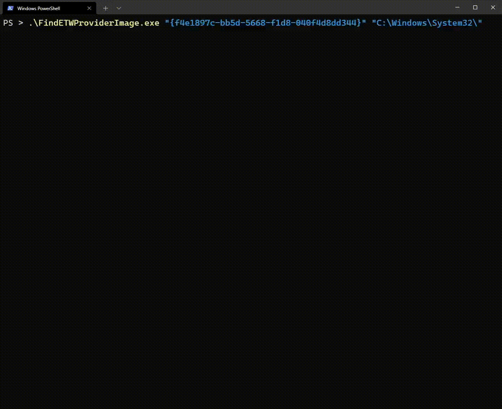

# FindETWProviderImage
Quickly search for references to a GUID in a target directory

## Usage:
```
.\FindETWProviderImage.exe "your-guid-here" "\path\to\search\directory"
```



## To Do:
- [ ] Add checks for `EventRegister()` and `EtwRegister()` to help identify providers
- [ ] Add provider name to GUID resolution functionality


## How it Works
1. Recursively search the supplied directory for files ending with `.dll`, `.exe`, or `.sys`
2. Use a [Boyer-Moore search](https://en.wikipedia.org/wiki/Boyer%E2%80%93Moore_string-search_algorithm) to parse each of the files for the target GUID across 4 threads
3. If references are found in the image, return the offset and relative virtual address (RVA) of each reference
